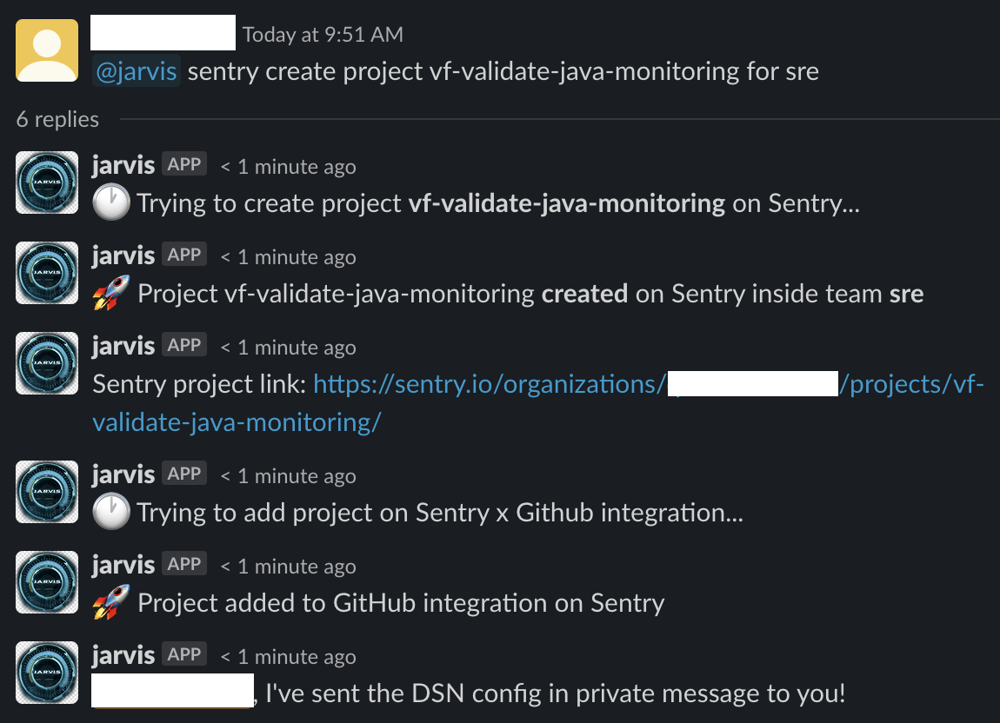
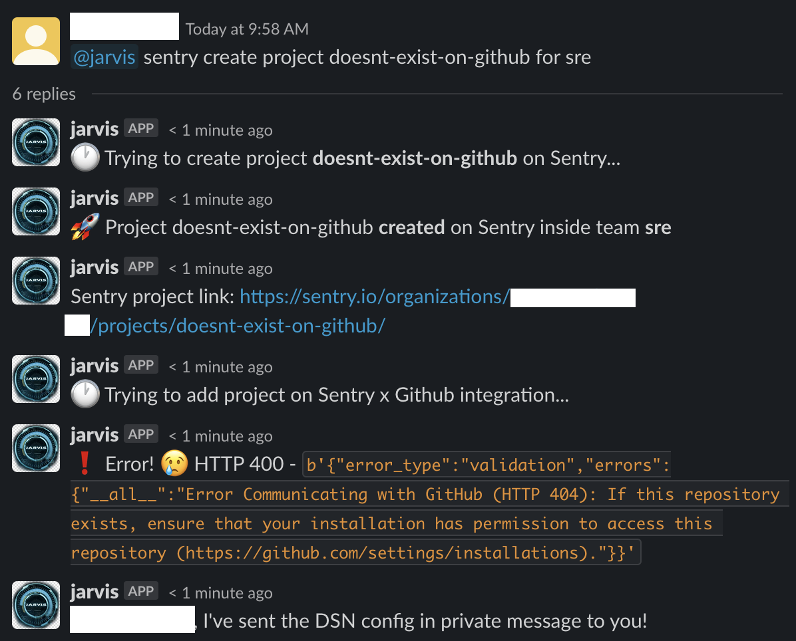
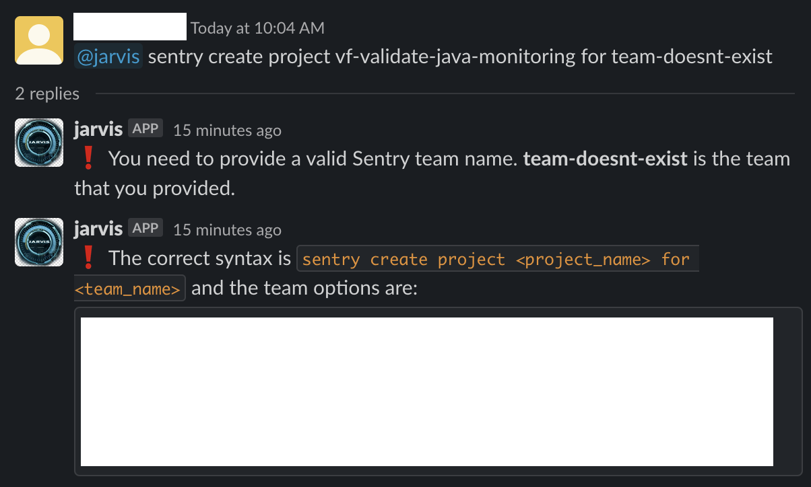

# errbot-plugin-sentry

#sentry #github #errbot #slack


This plugin is designed to be run inside an [errbot-based](https://errbot.readthedocs.io/en/latest/) bot and installed in your Slack workspace. The idea is to give autonomy to any developer in an IT Engineering structure to create a project within Sentry instead of having to open a ticket and wait for the activity to be done. When invoked, the bot  will:

1. [create a new project in Sentry](https://docs.sentry.io/product/sentry-basics/guides/integrate-frontend/create-new-project/) based on input from a requester and already assign it to a previously created team
2. if the Sentry organization has integration with Github, it will add the repository informed in this integration (to know more about this integration, click [here](https://sentry.io/integrations/github/))

## ⚙️ How its works?
As with all [other plugins](https://github.com/topics/errbot-plugins), the 'sentry.plug' and 'sentry.py' files must be placed inside the errbot's /plugins/<your-directory-plugin-name> directory, as in the structure shown below:
```
|_ errbot
   |_ plugins
      |_ sentry
         - sentry.plug
         - sentry.py
```

It has been tested and validated on Slack with the following packages:

errbot  |  slackclient |  websocket-client | 
------- | ----------- | -------------- | 
  6.1.7  |   1.3.2     |    0.54.0     |

You can use `!about` to check errbot version and `pip list` to check installed packages.

## Environment Variables
To make this plugin usable for everyone, some environment variables need to be given to errbot.
- [GITHUB_ORG](https://docs.github.com/en/account-and-profile/setting-up-and-managing-your-github-user-account/managing-your-membership-in-organizations/accessing-an-organization)
- [SENTRY_ORG_SLUG]
- [SENTRY_TOKEN]
- [SENTRY_GITHUB_INTEGRATION_ID]

## Sintaxe
You must to pass two parameters in the command to your bot:
- name of the project to be created within Sentry
- team created within Sentry

Example:
```
@your_bot sentry create project <your_project_name> for <your_sentry_team_name>
```

## 🔍 Results



**Attention:** if you inform a repository that does not exist in your GitHub account or its integration between Sentry x Github is not done, the project will be created inside Sentry, but the second step of the plugin will fail.


And finally, if you inform a Sentry team that doesn't exist, the bot will return to the requester informing you of the error and give a list of all teams created within the configured Sentry Organization.


## ✍️ Contributing
Any contributions you make are much appreciated.
